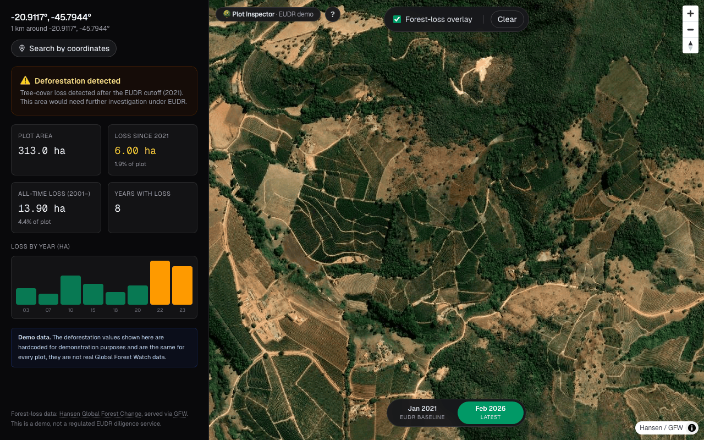

# 🌳 Plot Inspector, EUDR demo

> Type any latitude/longitude. We draw a 1 km circle around it and tell you
> whether the area has lost forest cover since the EU Deforestation Regulation
> cutoff (Dec 2020).

**Live demo:** [plot-inspector.vercel.app](https://plot-inspector.vercel.app/)



## Why this exists

The [EU Deforestation Regulation (EUDR)](https://environment.ec.europa.eu/topics/forests/deforestation/regulation-deforestation-free-products_en)
requires importers of soy, beef, palm oil, coffee, cocoa, rubber, wood and
their derivatives to prove their plots have not been deforested since
**31 December 2020**. The first regulated year is therefore 2021.

This app is a one-weekend slice of that workflow, a coordinate goes in, a
verdict + per-year breakdown comes out, built to validate the UX patterns
and data plumbing required.

## What it does

- **Search by coordinates**, type any lat/lng and we draw a 1 km circle
  around it. The geometry feeds the same tRPC procedure a real upload flow
  would.
- **Typed tRPC procedure** returns a year-by-year tree-cover-loss series for
  the plot, validated by Zod on both ends. Values are hardcoded for this
  demo, see _Demo data_ below.
- **EUDR verdict**, automatic compliance check against a 0.05 ha post-cutoff
  threshold, with a per-year chart that visually splits pre/post 2021.
- **Hansen tree-cover-loss raster overlay** on the map (red splotches),
  served by the public GFW tile server, no API key required.
- **ESRI Wayback time-travel basemap**, flip between the EUDR baseline
  (Jan 2021) and the latest imagery (Feb 2026) to spot tree-cover gaps that
  opened up inside your plot since the cutoff.
- **Guided tour**, first-load walkthrough using a real example (a coffee
  plot in Minas Gerais, Brazil, one of the world's largest coffee-export
  regions).

## Demo data

The numerical loss values returned by the tRPC procedure are **hardcoded**
in [`server/gfw.ts`](./server/gfw.ts) and are the same for every plot. A blue
banner inside the result panel makes this explicit. The hardcoded series spans
pre- and post-EUDR-cutoff years so the compliance-warning UI has something
meaningful to show. There is no live data path, the demo runs out of the
box with no env vars.

## Stack

| Layer      | Choice                                                    |
| ---------- | --------------------------------------------------------- |
| Framework  | Next.js 16 (App Router, RSC), React 19, TypeScript strict |
| API layer  | tRPC v11 + `@tanstack/react-query`, superjson transformer |
| Validation | Zod v4                                                    |
| Map        | MapLibre GL JS                                            |
| Geometry   | Turf (`area`, `bbox`, `centroid`)                         |
| State      | Zustand                                                   |
| Styling    | Tailwind CSS v4 (CSS-first `@theme`)                      |
| OG image   | Next.js `opengraph-image.tsx` (Edge runtime)              |
| Tooling    | Prettier · ESLint · Vitest                                |

## Decisions I made

- **Hardcoded loss data over a real GFW integration.** Wiring the Global
  Forest Watch raster API for plot-level queries would have eaten the whole
  weekend on auth, vector-tile decoding, and rate-limit handling. Validating
  the UX-and-data-plumbing story first felt more useful, the tRPC procedure
  signature and the Zod boundary are exactly what a real integration would
  use.
- **Search-by-coordinates over polygon drawing.** A lat/lng search hits the
  same downstream geometry pipeline as an uploaded polygon would (we just
  generate the polygon ourselves), but it's instant, frictionless, and
  works on touch. Drawing felt like half-baked craft for the scope;
  coordinate search felt like a polished primitive.
- **ESRI Wayback for "before / after"**, gives the user an immediate,
  intuitive way to _see_ deforestation that satisfies the eye in a way a
  chart can't.

## Running locally

```bash
npm install
npm run dev
# open http://localhost:3000
```

No environment variables are required.

```bash
npm run typecheck    # strict tsc
npm run lint         # ESLint (next/core-web-vitals + custom rules)
npm run format:check # Prettier check
npm run test:run     # Vitest (geometry helpers)
npm run build        # Production build
```

## Project structure

```
app/         Next.js routes, layout, providers, OG image, tRPC handler
components/  Inspector orchestrator, Map, MapControls, ImageryPicker,
             SearchByCoordinates, ResultPanel, Tour
server/      tRPC server: trpc.ts, routers/, gfw.ts (hardcoded demo data)
trpc/        Client-side tRPC instance (createTRPCReact)
store/       Zustand stores (app + tour)
lib/         Geometry helpers, ESRI Wayback + Hansen tile URL builders
```

The data flows like this:

```
User enters lat/lng  →  circlePolygon()  →  Zustand store
                                                ↓
                                trpc.deforestation.queryByPolygon.useQuery
                                                ↓
                        GET /api/trpc/…  →  tRPC fetch handler  →  server/gfw.ts
                                                                          ↓
                                                    hardcoded loss-by-year dataset
                                                ↓
                                    ResultPanel renders verdict + per-year chart
```

## What's intentionally out of scope

(Each of these is a fair "next step", not an oversight.)

- Polygon drawing on the map / GeoJSON upload (would feed the same tRPC
  procedure)
- Year-by-year time scrubber on the map
- PDF export of an EUDR due-diligence report
- Sentinel-2 NDVI before/after comparison
- 3D terrain visualization
- Multi-language UI (EN / DE / ZH)
- Saved-plots dashboard with auth
- Tests beyond pure helpers (the UI surface is heavy MapLibre + tRPC, and
  the value of integration tests against hardcoded data is low)

## Acknowledgements

- Forest-cover-loss dataset:
  [Hansen et al., 2013](https://glad.umd.edu/dataset/global-2010-tree-cover-30-m),
  served via [GFW](https://www.globalforestwatch.org/).
- [MapLibre GL](https://maplibre.org/), open-source vector mapping.
- ESRI World Imagery Wayback for time-travel basemap layers.

## License

MIT, see [LICENSE](./LICENSE).
